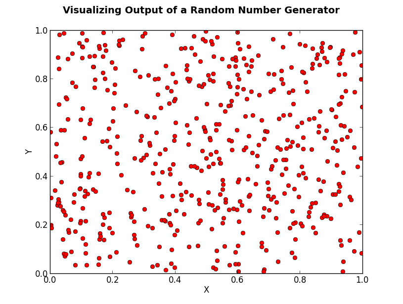
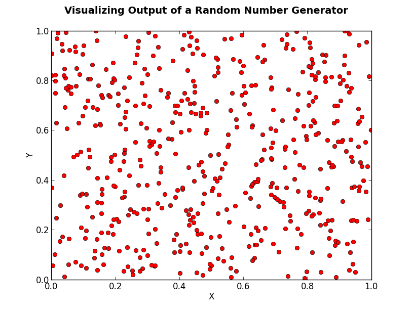
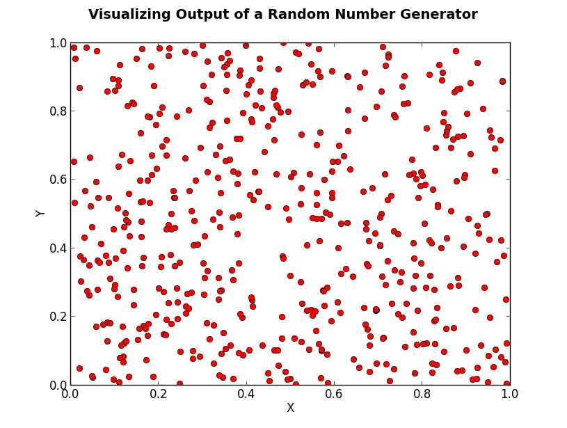

Jervis Muindi   
Numerical Algorithms and Complexity    
February 2013  
Homework 4    

Introduction
============
This project contains code that visualizes the quality of a pseudorandom number generator by graphing 512 random points in a unit square. 

Dependencies
===========
* Matpotlib: Please see [http://matplotlib.org/users/installing.html](this guide) for instructions on installing Matplotlib.

How to Run
==========
`$ python graph.py`

Sample Output
============
Below is some sample output obtained from runnign the script. 

 

Discussion
=========
From the graphs plotted above, one can see that there is a clustering of points together. In addition  
there are also some spots that are devoid of points - i.e. there are pockets of empty space. 

Based on this information, one can conclude that the pseudo random number generator used (the one builtin into the python
scripting language) is not perfectly uniform in all directions. 

